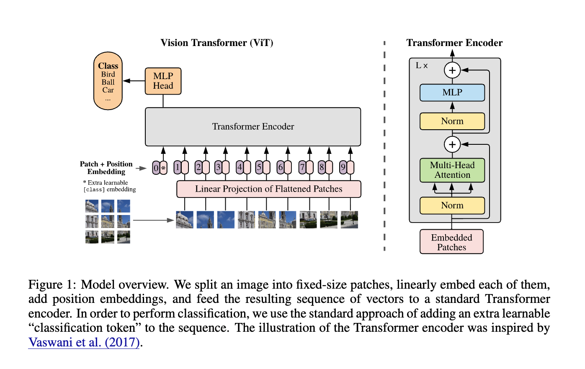
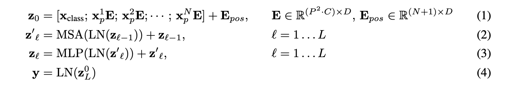

# ViT
将 NLP 中的 Transformer 架构引入到计算机视觉领域。展示了不使用CNN，仅使用 transformer 架构能够在图像分类任务上表现很好。能够达到和 CNN 同样的效果，但是使用更少的计算资源训练。

架构图如下：

架构详解
首先一个图片表示为 $x\in \mathbb{R}^{H\times W \times C}$ ，其中 H W 为原始分辨率，C表示 channel，通常为3。然后经过分块和拉平得到 $x_p \in \mathbb{R}^{N \times (P^2\cdot C)} $ 其中P 表示每个块的大小，N表示分成的块的数量。

然后具体公式如下：

重要的部分有如下几点

1. 在头部加一个[class] token ，这个没有意义并可学习，作用是能够与所有图像块交互，聚合全局信息。
2. 分类头，预训练的时候，分类头是一个多层感知机，微调的时候，单一的线性层。
3. 位置编码，通过额外加一个可学习的1D位置编码进行