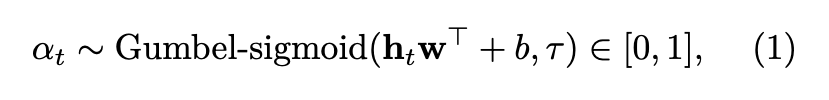
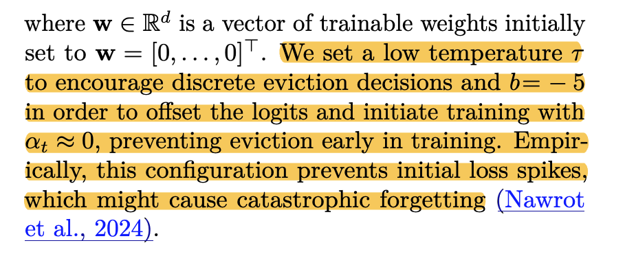
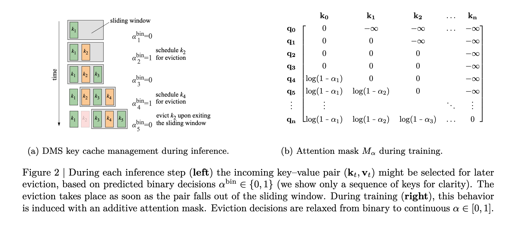

# Inference-Time Hyper-Scaling with KV Cache Compression

# 概述
只需要训练 1K steps 就能达到 8x 的压缩率。
具体方法如下：

针对一个kv pair，通过训练得到一个常数 $\alpha$，通过该阈值决定某个kv pair 需要被删除

其中 $w\in \mathbb{R}^d$ 并初始化为0，d 表示 hidden_state 中的 d。使用低温 $$ 用于生成更加离散的决策。$b=-5$ 用于调整分布的中心，使得最开始 $\alpha$ 在0 附近。如此设置的原因是为了维持训练初期的稳定性。避免过早开始淘汰。

具体流程如下：
有一个sliding window，sliding window 中的数据一直保存，当某个cache 出了 sliding window 之后按照 $log(1-\alpha_1)$ 进行淘汰。

# 训练
训练目标来说，有两个，一个是 Auxiliary Loss 用于控制到目标的稀疏度。另一个是 logit distillation loss，即 $\alpha$ 和full-attn 中 softmax 之间的KL 散度作为loss。作用是使得$\alpha$ 的概率分布逼近full-attn 中的softmax。

# 问题
如果不是负无穷，需要被淘汰么，还是说能保证淘汰的一定是负无穷？